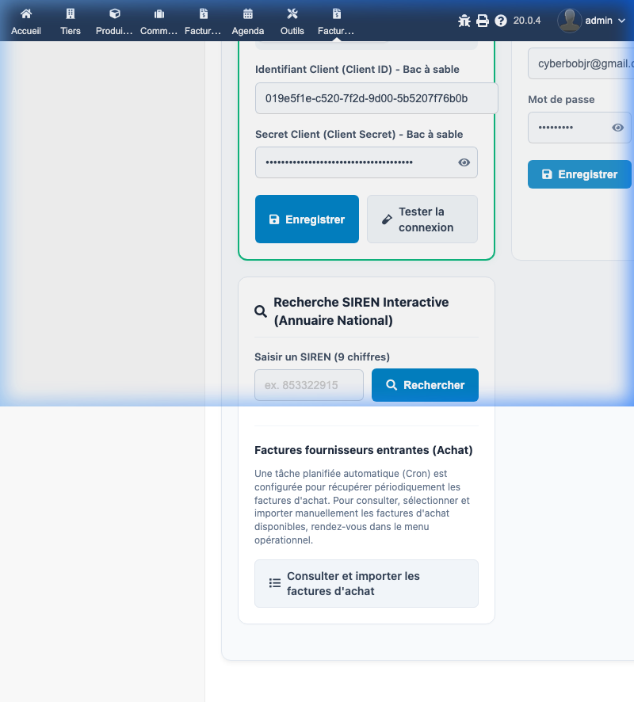
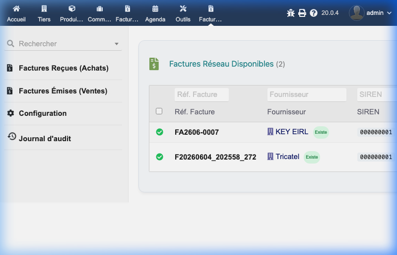
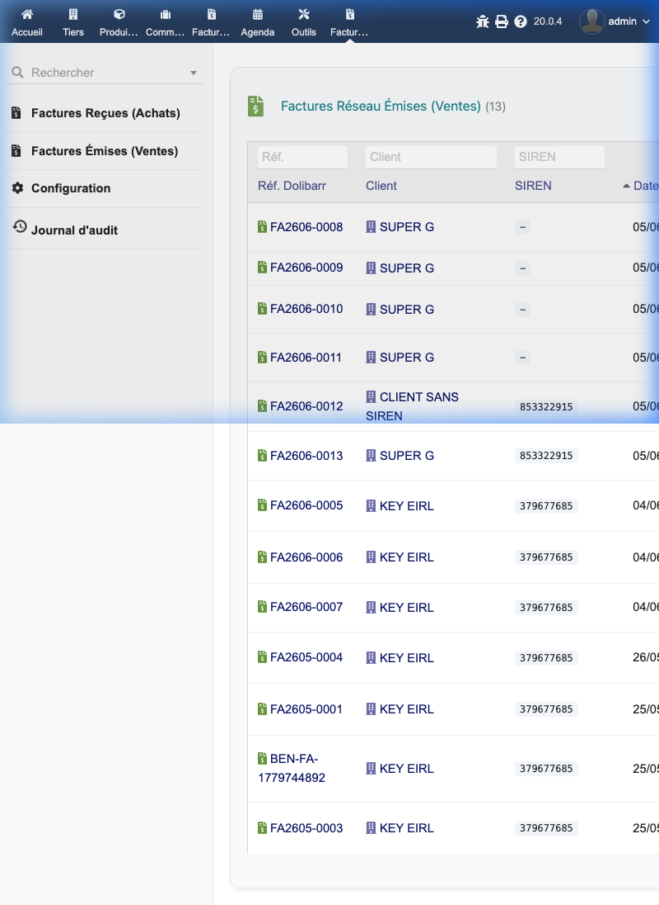
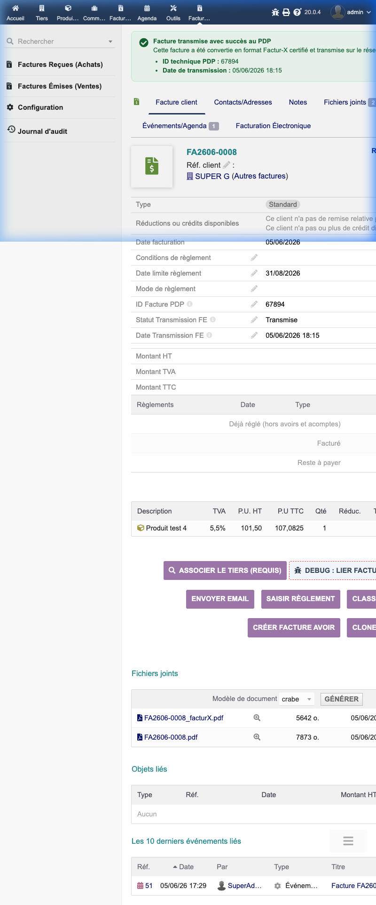
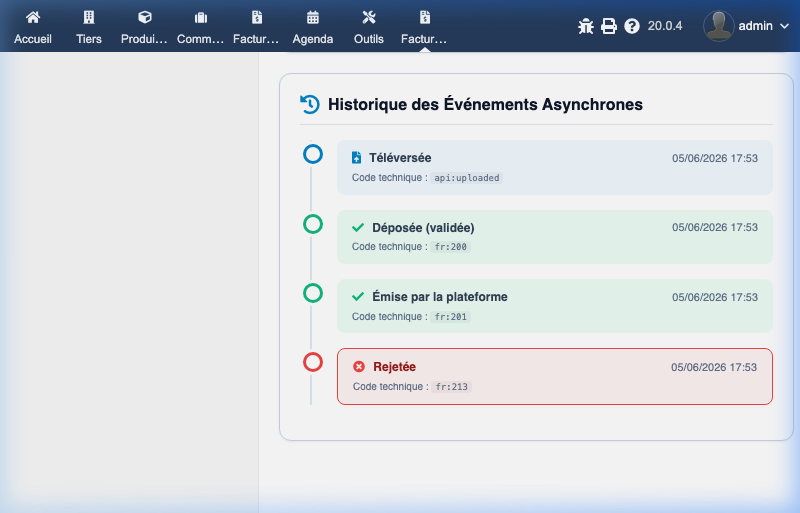
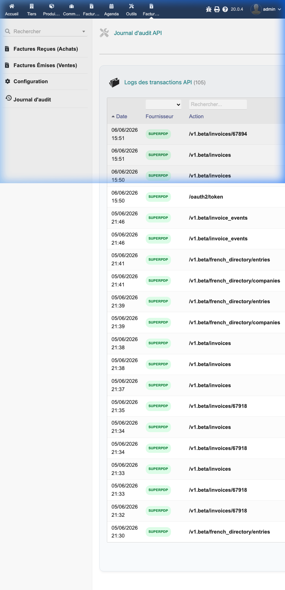

# Guide de l'utilisateur - Module de Facturation Électronique B2B (France)

Ce module permet d'intégrer Dolibarr avec les Plateformes de Dématérialisation Partenaires (PDP) telles que **SuperPDP** et **FactPulse**, afin de gérer l'envoi et la réception de factures électroniques au format standardisé (Factur-X) conformément à la réglementation française.

---

## 1. Configuration du Module

La configuration générale du module s'effectue via l'interface d'administration de Dolibarr, sous **Configuration -> Modules/Applications**, puis en cliquant sur l'icône d'engrenage du module **Facturation Électronique**.

### 1.1 Fournisseurs de service (PDP)
Le module prend en charge plusieurs PDP. Le fournisseur actuellement actif est mis en évidence en haut de la page.

*   **SuperPDP** :
    *   **Mode de fonctionnement** : Permet de basculer entre le mode *Bac à sable (Sandbox)* pour les tests et le mode *Production*.
    *   **Identifiants** : Renseignez l'**Identifiant Client (Client ID)** et le **Secret Client (Client Secret)** fournis par la plateforme.
    *   **Actions** : Vous pouvez sauvegarder vos modifications et cliquer sur **Tester la connexion** pour valider vos accès auprès de l'API SuperPDP.
*   **FactPulse** :
    *   Permet la connexion à l'aide d'un couple **Email de connexion (Username)** et **Mot de passe**.
    *   Vous pouvez l'activer comme fournisseur principal via le bouton dédié.

### 1.2 Recherche SIREN Interactive
Un outil de recherche est disponible dans l'onglet de configuration pour interroger directement l'**Annuaire National** à partir d'un numéro SIREN à 9 chiffres. Cela permet de vérifier la présence et les détails d'une entreprise avant toute transaction.

### 1.3 Récupération Automatique
Les factures d'achat entrantes sont récupérées périodiquement par une tâche planifiée (Cron). Un bouton d'accès rapide permet également d'accéder directement à l'écran opérationnel d'importation.

---

## 2. Gestion des Factures Reçues (Achats)

Accessible via le menu **Facturation Électronique > Factures Réseau Reçues**.

Cet écran répertorie toutes les factures fournisseurs disponibles sur le réseau national (transmises par vos fournisseurs sur le PDP).

*   **Reconnaissance automatique des Tiers** : Le module analyse le SIREN de l'émetteur. Si le tiers existe déjà dans votre base Dolibarr, un lien direct vers sa fiche tiers s'affiche avec un badge vert **Existe**.
*   **Importation** : Vous pouvez sélectionner une ou plusieurs factures et lancer l'importation automatique sous forme de factures fournisseurs de type brouillon dans Dolibarr.

---

## 3. Gestion des Factures Émises (Ventes)

Accessible via le menu **Facturation Électronique > Factures Réseau Émises**.

Cet écran répertorie les factures Dolibarr émises à destination de vos clients, avec leur statut de transmission sur le réseau.

---

## 4. Intégration sur la Fiche Facture Client

### 4.1 Bandeau de statut et champs personnalisés
Lorsqu'une facture est validée et transmise, un bandeau d'information vert s'affiche en haut de sa fiche dans Dolibarr :
*   **ID technique PDP** : L'identifiant de la facture sur la plateforme.
*   **Date de transmission** : La date à laquelle la transmission a été effectuée.

Les attributs supplémentaires de la facture sont mis à jour en base de données pour en assurer le suivi.

### 4.2 Fichiers Joints (Factur-X)
Dans la section des fichiers joints de la facture, vous retrouverez :
*   Le PDF standard généré par Dolibarr.
*   Le fichier PDF certifié Factur-X (reconnaissable au suffixe `_facturX.pdf`), contenant les métadonnées XML structurées requises par l'administration fiscale.

### 4.3 Onglet "Facturation Électronique"
Cet onglet dédié sur la fiche facture permet d'accéder au détail technique de la transmission :
*   **Lien direct portail** : Un bouton **Ouvrir sur le portail SuperPDP** permet d'accéder à la facture directement sur la console web du fournisseur.
*   **Historique des Événements Asynchrones** : Une chronologie visuelle liste les étapes clés du traitement réseau :
    1.  *Téléversée* (`api:uploaded`)
    2.  *Déposée (validée)* (`fr:200`)
    3.  *Émise par la plateforme* (`fr:201`)
    4.  *Rejetée* (`fr:213`) en cas d'erreur de validation.

---

## 5. Journal d'Audit

Accessible via le menu **Facturation Électronique > Journal d'audit**.

Il offre une traçabilité complète de l'ensemble des échanges API entre votre Dolibarr et les serveurs du PDP. Chaque ligne indique la date, le fournisseur concerné et l'action/endpoint API sollicité (ex: `/oauth2/token`, `/v1.beta/invoices`, etc.).

